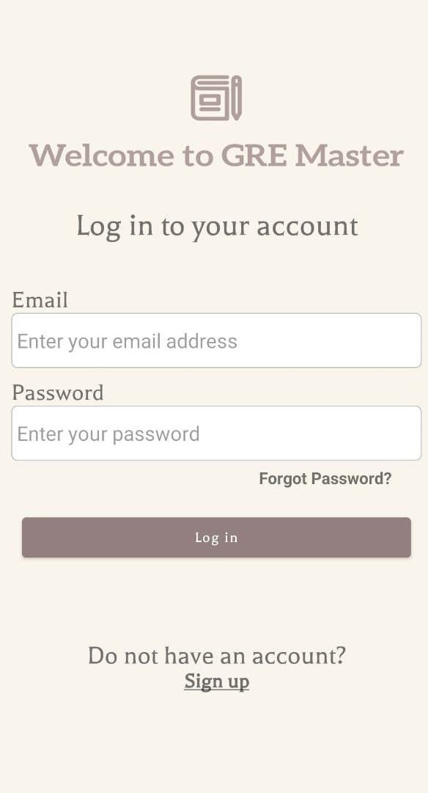
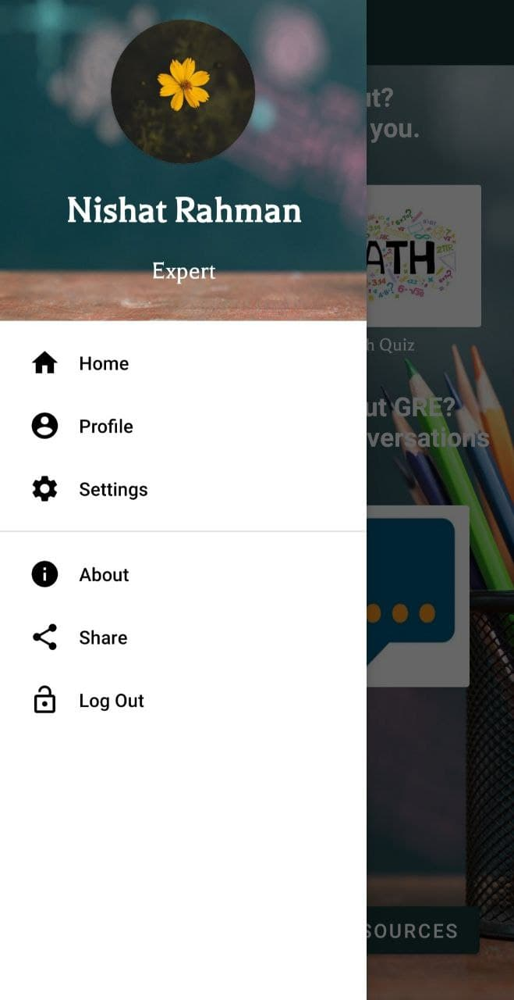
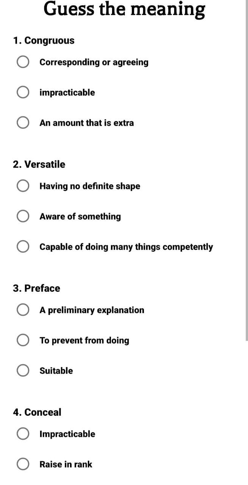
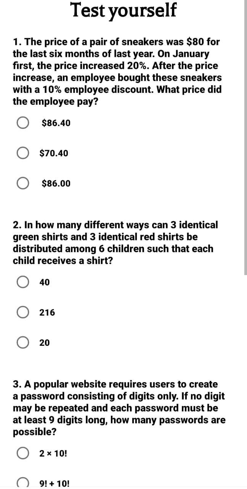
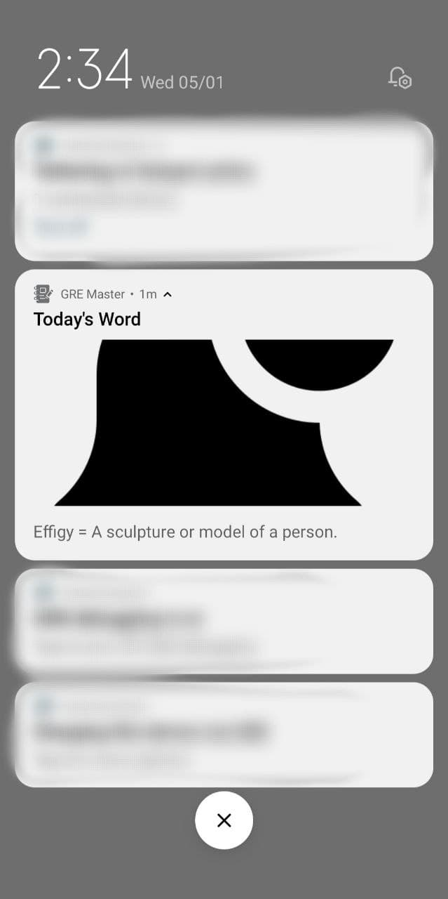
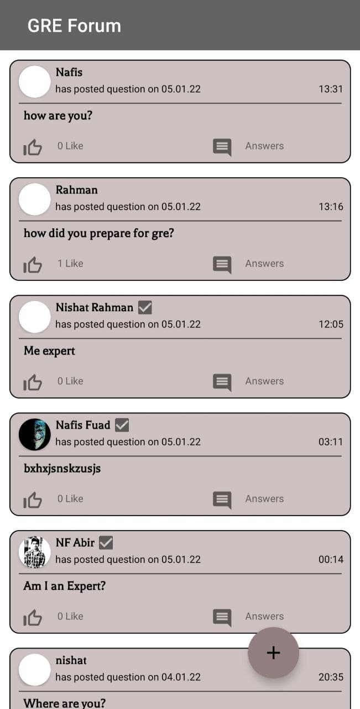
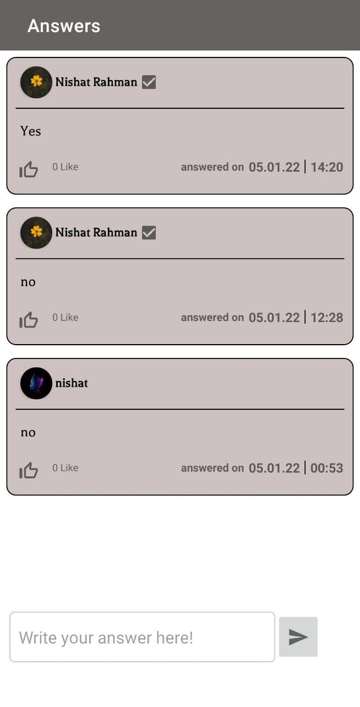
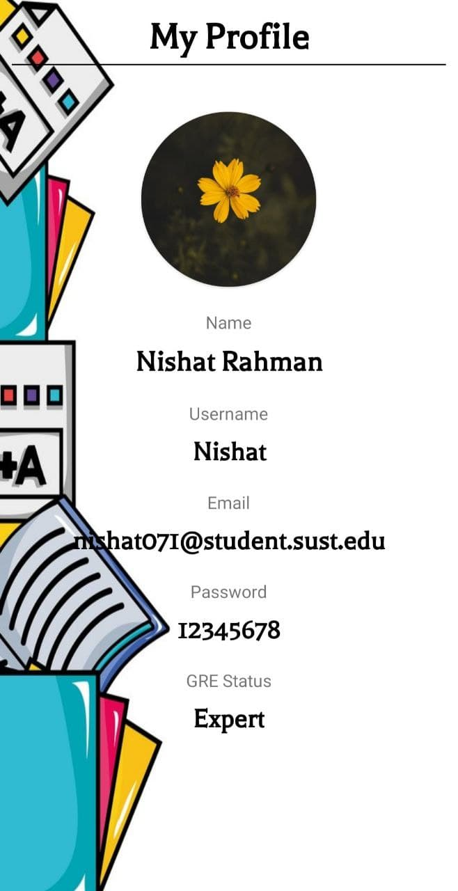
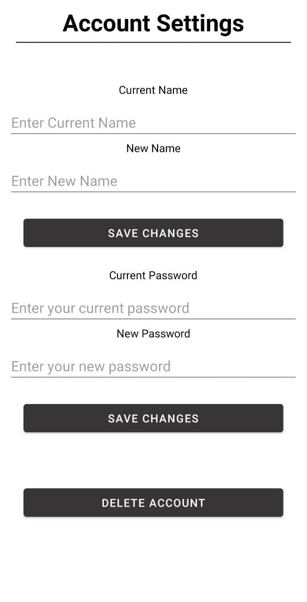

Introduction
------------
GRE  Master is an android app that offers users to prepare themselves for GRE in a directed way.
It's quite hard to take preparation for GRE while maintaining academic studies.
GRE Master is to help users to ease their road to GRE.

Functionalities & Features
--------------------------
Users have to Create an account or Sign up to use the features of the app. 

   

This is how the Home page looks like.  

   

There is also a Sidebar.  

  

### Key Features
* **Quizzer:** Users can take quizzes from here to testify themselves.  

 

* **Daily vocabulary dose:** Users will receive a word and its meaning via notification on a daily basis.  

* **Discussion forum:** Users can be engaged in discussion of GRE related topics and inquiries where GRE experts can answer their queries.  

 

There is a also a leaderboard based on the quizzes.  

Other that these, users can see and change their credentials from Profile and Settings section.  

 
