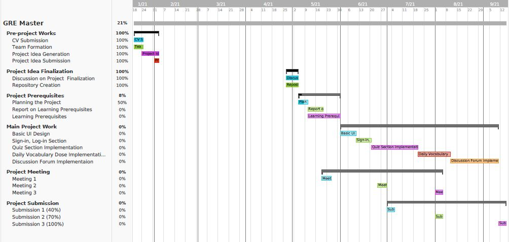

# G33-GRE-Master

Feature Description
--------------------

* *Quizzer:* Users will be able to take math and verbal quizzes.
* *Daily Vocabulary Dose:* Users will recieve a notification with a new vocabulary word everyday if they want.
* *Discussion Forum:* Users can be engaged in discussion of GRE related topics and inquiries.

Expected Timeline
------------------

Report on Learning Pre-requisites
----------------------------------

SL | Learning Task | Description | Status | Comment |
--:|:--------------|:------------|:------:|---------|
1  | Java | Basic and Advance Java |   | |
2  | Android Studio  | Features of Android Studio |  | |
3  | XML | Basic XML |  | |
4  | Firebase | Database and API | | |
